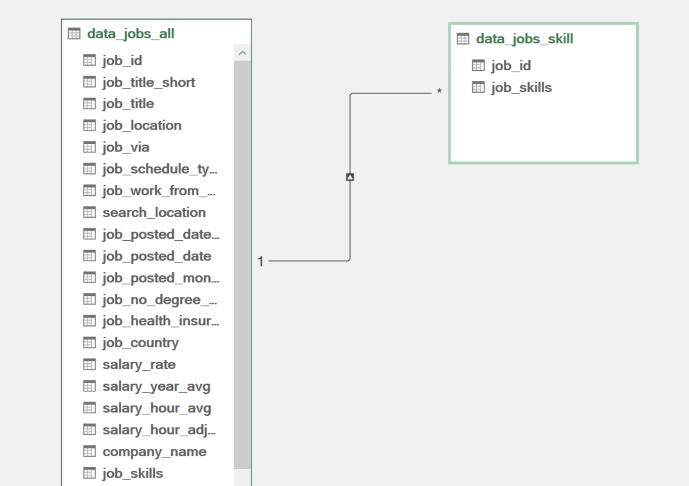

# Project Analysis 

## Introduction
Driven by firsthand experience as a job seeker and a gap in market insights, this project analyzes real-world 2023 data science job postings to identify optimal skills, salary trends, and regional variations. The goal is to empower professionals with actionable strategies for career advancement and compensation growth.

## Key Questions Evaluated
1. Does a broader skill set correlate with higher pay?

2. How do salaries for data roles vary across regions?

3. What are the most in-demand skills for data professionals?

4. What is the salary premium for top 10 skills?

## Methodology & Tools
**Dataset: Curated 2023 job listings detailing:**

👨‍💼 Job titles | 💰 Salaries | 📍 Locations | 🛠️ Skills

**Excel Toolkit:**

- 📊 Power Query: Data extraction, transformation (ETL), and cleaning.

- 💪 Power Pivot: Data modeling and relationship management.

- 🧮 DAX: Advanced calculations (e.g., median salary).

- 📈 PivotTables/PivotCharts: Dynamic aggregation and visualization.

## Analysis & Insights

### 1️⃣ Skill Quantity vs. Salary

**Approach:**

- Extracted and transformed job and skill tables using Power Query, then linked both tables via their job_id in Power Pivot.

- Calculated median salaries by role and skill count.

**Insights:**

- 📈 Positive correlation: Roles requiring more skills (e.g., Senior Data Engineer) command higher median salaries.

- 💼 Entry-level positions (e.g., Business Analyst) with fewer skills offer lower compensation.

- Implication: Diversifying technical skills directly enhances earning potential.


*This scatter plot visualizes the relationship between the number of skills required for a role and their corresponding median salaries. Each point represents a job posting, revealing whether positions demanding more skills tend to offer higher pay. The trend helps identify skill quantity as a potential factor in salary determination, though outliers may suggest other influencing variables*

### 2️⃣ Regional Salary Variations
**Approach:**

- Used DAX to calculate region-specific medians:

```excel
US Median Salary = CALCULATE(  
    MEDIAN(data_jobs_all[salary_year_avg]),  
    data_jobs_all[job_country] = "United States")  
```
- Compared U.S. vs. global salaries via PivotTables.


**Insights:**

- 💰 U.S. premium: Senior roles (e.g., Data Scientist) pay 20-30% more in the U.S. vs. non-U.S. markets.

- 🌍 High demand for specialized skills persists globally, but tech hubs  drive salary peaks.

- Implication: Geography significantly impacts negotiation leverage.


*Median Data Job Salary: Total, US-Based, Non-US Based*

### 3️⃣ Top In-Demand Skills

**Approach:**

- Mapped skill frequency using a Power Pivot data model linking job_id in both tables



**Insights:**

- 🥇 Core skills: SQL (49%) and Python (46%) dominate job requirements.

- ☁️ Emerging demand: Cloud platforms (AWS, Azure) and big data tools rank in the top 10.

- Implication: Foundational programming + cloud expertise are non-negotiable for competitiveness.


*Data Job Skills: Relative Likelihood*

### 4️⃣ Salary Premium for Top Skills
**Approach:**

- Combo PivotChart plotting median salary (columns) vs. skill likelihood (line).

**Insights:**

- ⬆️ High-value skills: Proficiency in SQL and Python is highly sought-after in data-related roles, underscoring their critical importance in data processing and analysis. .

- ⬇️ Lower premium: Generalist tools (e.g., PowerPoint, Word) show weaker salary linkage.

- Implication: Prioritize learning specialized tools (e.g., Python) for maximum ROI.


## Conclusion

This analysis confirms that specialized technical skills (Python, SQL, cloud platforms) and experience level are primary salary drivers in the data science market. Regional disparities highlight the U.S. as a high-reward market, while skill diversification remains universally critical. For job seekers: target skill acquisition in high-value areas to unlock senior roles and salary growth. For employers: align compensation with skill demand and geography to attract top talent.

## Key Takeaways
- 🎯 Skill strategy: Depth > breadth; prioritize Python, SQL, and cloud certifications.

- 🌎 Location factor: U.S. roles offer higher pay but face steeper competition.

- 📊 Tool mastery: Excel’s advanced features (Power Query, DAX) enable robust real-world analysis.


